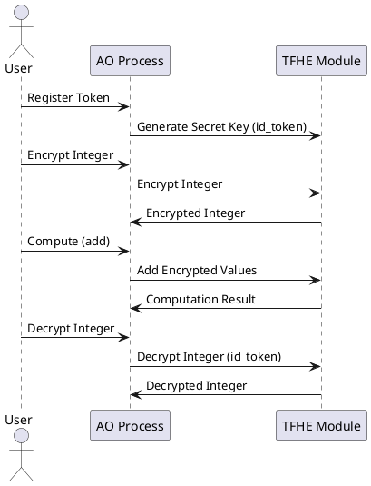
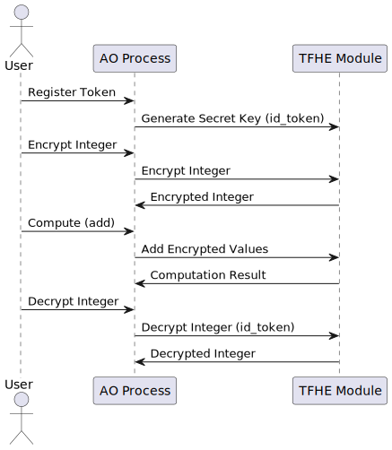

---

# AO FHE JWT Token Demo

## Overview

This module demonstrates Fully Homomorphic Encryption (FHE) operations using the EntityOfCode AO framework and JWT tokens for secure decryption. The AO process covers the following key operations:
- **Token Registration**: A token is registered, and an FHE secret key is generated based on the token's `id_token`.
- **Encryption**: Integer values are encrypted using the FHE module.
- **Computation**: Arithmetic operations (e.g., addition) are performed on encrypted values.
- **Decryption**: Encrypted values are decrypted securely using the registered token.

## Key Operations

### Register Token
Registers a token in the AO process and generates a secret key using the `id_token`.

```lua
Handlers.add(
    "registerToken",
    Handlers.utils.hasMatchingTag("Action", "RegisterToken"),
    function(msg)
        local_s = {}
        local_s["data"] = msg.Data
        if local_s["data"] then
            Tfhe.generateSecretKey(json.decode(local_s["data"]).id_token)
        end
    end
)
```
### Encrypt Integer Value
Encrypts an integer value using the FHE module.

```lua
Handlers.add(
    "EncryptIntegerValue",
    Handlers.utils.hasMatchingTag("Action", "EncryptIntegerValue"),
    function(msg)
        local_s = Tfhe.encryptInteger(msg.Data)
    end
)
```

### Compute Operation on Encrypted Data
Performs arithmetic operations (e.g., addition) on encrypted values.

```lua
Handlers.add(
    "computeOperationOnEncryptedData",
    Handlers.utils.hasMatchingTag("Action", "ComputeOperationOnEncryptedData"),
    function(msg)
        local data = json.decode(msg.Data)
        local_s = Tfhe.addCiphertexts(data.param_value_left, data.param_value_right)
    end
)
```

### Decrypt Integer Value
Decrypts an integer value using the registered id_token.

```lua
Handlers.add(
    "DecryptIntegerValue",
    Handlers.utils.hasMatchingTag("Action", "DecryptIntegerValue"),
    function(msg)
        local_s = Tfhe.decryptInteger(msg.Data, msg.Tags.id_token)
    end
)
```
## Process Flow
Here is the process flow for the AO FHE operations:





## Client Usage
The client can interact with the AO FHE process using the provided JavaScript script [aofhetoken.js](src/aofhetoken.js) that utilizes @permaweb/aoconnect for communication with the AO process. Below are the key functions available for client-side usage:

### Environment Setup
Ensure that the .env file defines the following environment variables:

JWK: Wallet secret key (in JSON format).
FHE_PROCESS_ID: The process ID of the AO FHE process.
ID_TOKEN: The ID token used for registering and decrypting operations.
### Key Client Functions
1. **Register Token** The client registers a token, which generates the FHE secret key using the id_token:

```javascript
async function registerToken(id_token) {
    const messageId = await message({
        process: ao_process_id,
        signer: createDataItemSigner(wallet),
        data: '{"id_token:"' + id_token + '"}',
        tags: [{ name: 'Action', value: 'RegisterToken' }],
    });
    return messageId;
}
```
2. **Encrypt Integer Value** The client can encrypt an integer value using the following function:

```javascript
async function encryptIntegerValue(value) {
    const encryptedValue = await dryrun({
        process: ao_process_id,
        data: value.toString(),
        tags: [{ name: 'Action', value: 'EncryptIntegerValue' }],
    });
    return encryptedValue.Messages[0].Data;
}
```
3. **Decrypt Integer** Value The client decrypts an encrypted integer value using the registered id_token:

```javascript
async function decryptIntegerValue(value, id_token) {
    const decryptedValue = await dryrun({
        process: ao_process_id,
        data: value.toString(),
        tags: [
            { name: 'Action', value: 'DecryptIntegerValue' },
            { name: 'id_token', value: id_token },
        ],
    });
    return decryptedValue.Messages[0].Data;
}
```
4. **Compute on Encrypted Data** The client can perform an arithmetic operation (e.g., addition) on two encrypted values:

```javascript
async function computeOperationOnEncryptedData(val_left, val_right) {
    const result = await dryrun({
        process: ao_process_id,
        data: JSON.stringify({
            param_value_left: val_left,
            param_value_right: val_right
        }),
        tags: [
            { name: 'Action', value: 'ComputeOperationOnEncryptedData' },
            { name: 'operation', value: 'add' },
        ],
    });
    return result.Messages[0].Data;
}
```
### Example Usage
The following is an example of registering a token, encrypting two integers, performing an addition operation on the encrypted values, and decrypting the result:

```javascript
(async () => {
    const val_left = getRandomNumber16Bit();
    const val_right = getRandomNumber16Bit();
    const registerToken = await registerToken(id_token);
    
    const encryptedSum = await computeOperationOnEncryptedData(
        await encryptIntegerValue(val_left), 
        await encryptIntegerValue(val_right)
    );

    const decryptedSum = await decryptIntegerValue(encryptedSum, id_token);
    
    console.log(`Decrypted sum: ${decryptedSum}`);
})();
```
## How to Run
Load the AO Process with the FHE module:

```sh
aos process_name --module=lZ-vBcgqmfOS8uqLhVkuo5I4Lfh1bEyqL4V93qZ6K2I
```
Load the aofhetoken.lua script:

```sh
.load process/aofhetoken.lua
```
Test your process: Ensure that the .env file defines the JWT (wallet secret key) and FHE_PROCESS_ID.

# FHE Lua Handlers in AO Process

## Overview

This document provides an overview of the Lua Handlers and action tags used in the AO process, focusing on Fully Homomorphic Encryption (FHE). It also highlights the specific module requirement for enabling FHE computation within AO processes.

## Key Module Requirement

The AO process script relies on a crucial module to enable FHE computations. The following line is pivotal in importing the necessary functionality:

```lua
local Tfhe = require("eoc_tfhe")
```

### Module Support Requirement

For the AO process to support FHE computation, it must be loaded with the specific module using the following flag:

```sh
aos process_name --module=txrhC5fLXKgnyRm-WMmOsLzBEZkplT6T6gzuRvA7JFE
```

This module (`txrhC5fLXKgnyRm-WMmOsLzBEZkplT6T6gzuRvA7JFE`) is essential as it provides the necessary environment and functions for FHE operations within the AO process. This particular code implementation is significant as it represents the first instance of FHE computation being supported on AO Processes.

## Fully Homomorphic Encryption (FHE)

FHE is an encryption scheme that allows computations to be performed on encrypted data without needing to decrypt it first. This ensures that the data remains secure throughout the computation process.

## Generating a Secret Key for FHE Operations

To perform any Fully Homomorphic Encryption (FHE) operation with the FHE module, it is necessary to generate a secret key. This key is crucial as it is used in all FHE operations to ensure data security and privacy. The secret key is generated using the `Tfhe.generateSecretKey()` function, which must be executed before any encrypted computations are performed.

### Example of Generating a Secret Key

Here’s how you can generate a secret key in your Lua script:

```lua
local secretKey = Tfhe.generateSecretKey()
```

The `generateSecretKey` function initializes a secret key, which is essential for encrypting and decrypting data securely. This secret key will then be used in subsequent operations to encrypt and decrypt data, ensuring that all computations remain secure and private.

### Importance in FHE

In Fully Homomorphic Encryption, the secret key allows users to perform arbitrary computations on encrypted data without decrypting it. This capability is fundamental for privacy-preserving computations, such as secure data processing and encrypted cloud computing, where sensitive information must remain confidential.

By using `Tfhe.generateSecretKey()`, users ensure that their data remains protected throughout the computation process, adhering to the principles of FHE.

## Lua Handlers

Lua handlers are functions attached to specific events or actions within the AO process. These handlers execute predefined logic when their corresponding events are triggered.

### Key Handlers

1. **GetEncryption()**
   - **Purpose**: Retrieves the table containing all encryption information.
   - **Type**: Getter
   - **Example Usage**: `local encryptionData = GetEncryption()`

2. **EncryptIntegerValue(Val: String)**
   - **Purpose**: Encrypts an integer value using FHE.
   - **Type**: Getter
   - **Parameters**:
     - `Val`: The string representation of the integer value to be encrypted.
   - **Example Usage**: `local encryptedValue = EncryptIntegerValue("123")`

3. **DecryptIntegerValue(Val: String)**
   - **Purpose**: Decrypts an encrypted integer value.
   - **Type**: Getter
   - **Parameters**:
     - `Val`: The string representation of the encrypted value to be decrypted.
   - **Example Usage**: `local decryptedValue = DecryptIntegerValue(encryptedValue)`

4. **ComputeOperationOnEncryptedData(operation: String, ao_id_val_left: String, ao_id_val_right: String)**
   - **Purpose**: Computes an operation on two encrypted values using FHE.
   - **Type**: Getter
   - **Parameters**:
     - `operation`: The operation to be performed (e.g., "add", "multiply", "compare").
     - `ao_id_val_left`: The ID of the first encrypted value.
     - `ao_id_val_right`: The ID of the second encrypted value.
   - **Example Usage**: 
     - Arithmetic: `local result = ComputeOperationOnEncryptedData("add", encryptedVal1, encryptedVal2)`
     - Boolean: `local result = ComputeOperationOnEncryptedData("and", encryptedBool1, encryptedBool2)`
     - String Comparison: `local result = ComputeOperationOnEncryptedData("equals", encryptedStr1, encryptedStr2)`

5. **GetDataByKv(Key: String, Val: String)**
   - **Purpose**: Retrieves encrypted data based on key-value pairs.
   - **Type**: Getter
   - **Parameters**:
     - `Key`: The key to search for.
     - `Val`: The value associated with the key.
   - **Example Usage**: `local data = GetDataByKv("username", "encryptedUser")`

6. **StoreEncryptedData(Data: String)**
   - **Purpose**: Stores encrypted data provided by the sender. The data must be correctly formatted as an instance of encrypted data.
   - **Type**: Function
   - **Parameters**:
     - `Data`: The encrypted data string to be stored.
   - **Example Usage**: `StoreEncryptedData(encryptedDataInstance)`

## Extended Compute Operations

The compute operations in the AO process are designed to handle not just arithmetic operations on encrypted integers but also Boolean operations and string comparisons.

### Boolean Operations

- **AND**: Performs a logical AND operation on two encrypted Boolean values.
- **OR**: Performs a logical OR operation on two encrypted Boolean values.
- **NOT**: Performs a logical NOT operation on an encrypted Boolean value.
  
**Example Usage**: 
```lua
local resultAnd = ComputeOperationOnEncryptedData("and", encryptedBool1, encryptedBool2)
local resultOr = ComputeOperationOnEncryptedData("or", encryptedBool1, encryptedBool2)
local resultNot = ComputeOperationOnEncryptedData("not", encryptedBool)
```

### String Comparisons

- **Equals**: Compares two encrypted strings for equality.
- **GreaterThan**: Checks if the first encrypted string is greater than the second.
- **LessThan**: Checks if the first encrypted string is less than the second.

**Example Usage**:
```lua
local isEqual = ComputeOperationOnEncryptedData("equals", encryptedStr1, encryptedStr2)
local isGreater = ComputeOperationOnEncryptedData("greaterthan", encryptedStr1, encryptedStr2)
local isLess = ComputeOperationOnEncryptedData("lessthan", encryptedStr1, encryptedStr2)
```

## Action Tags

Action tags are labels or identifiers used within the AO process to trigger specific handlers. These tags are associated with particular operations or events in the Lua script.

### Common Action Tags

- **Initialize**: Triggered during the initialization phase of the AO process. It sets up the necessary environment, variables, and handlers.

- **Encrypt**: Associated with the encryption process, this tag is used to invoke handlers that perform encryption operations.

- **Decrypt**: Linked to decryption processes, this tag triggers the decryption handlers to retrieve plaintext from encrypted data.

- **Compute**: Used for operations involving computation on encrypted data. Handlers linked to this tag perform arithmetic, Boolean, or string comparison operations on encrypted values.

- **Store**: This tag is associated with the storage of encrypted data. Handlers triggered by this tag ensure that data is correctly formatted and stored.

## Example Workflow

Here’s a simplified example of how these handlers and action tags might work together in a typical AO process:

1. **Initialization**: The process starts with the `Initialize` action tag, setting up the environment and attaching necessary handlers.
   
2. **Encrypt Data**: The `Encrypt` action tag is triggered, invoking the `EncryptIntegerValue()` handler to encrypt a specific integer.

3. **Store Data**: The encrypted data is stored using the `Store` action tag, which calls the `StoreEncryptedData()` handler.

4. **Compute Operation**: An operation is performed on two encrypted values using the `Compute` action tag, which utilizes the `ComputeOperationOnEncryptedData()` handler for arithmetic, Boolean, or string comparisons.

5. **Decrypt Result**: Finally, the result is decrypted using the `Decrypt` action tag, triggering the `DecryptIntegerValue()` handler.

## How to Run the Code

To learn how to run the code in this repository, please refer to the [AO FHE Process walkthrough](./load_ao_fhe_process.md). This document provides detailed steps on how to load and execute the AO process with the FHE module, including examples of loading the `aofhe.lua` script and testing the process.

## Test Example: Encryption Operation Over AO Process without leaving a trace of the values in the messages

This repository includes a test example that demonstrates how to perform encryption operations over an AO process using the <a href="https://www.npmjs.com/package/@permaweb/aoconnect#dryrun" target="_blank">`dryrun`</a> function from the `@permaweb/aoconnect` package. The test script encrypts and decrypts integer values by using `dryrun` to securely transmit these values without exposing them in the messages. 

The script leverages the encryption library to encrypt the value and utilizes specific actions and tags parameters to define the encryption operation and pass the encrypted value as a tag. This encrypted output can then be processed and stored using the [`message`](https://www.npmjs.com/package/@permaweb/aoconnect#message) function, ensuring the integrity and confidentiality of the data throughout its lifecycle.
 

### Overview of the Test

The script [`encryptionWithDry.js`](./src/encryptionWithDry.js) shows how to:
1. **Encrypt an Integer Value**: The script encrypts an integer value by sending it within the `ao msg.Tags` using the `dryrun` function, ensuring that the actual value is not directly exposed in the messages.
2. **Decrypt the Encrypted Value**: The encrypted value is then decrypted to verify that the encryption and decryption processes are correctly implemented.

This example serves as a reference for developers looking to implement encryption operations securely over AO processes.

### Running the Test

To run the test example, make sure you have the required environment variables set up and the dependencies installed:

1. **Set Environment Variables**: Ensure that the `FHE_PROCESS_ID` environment variable is configured in your `.env` file.
2. **Install Dependencies**: Run `npm install` to install the necessary packages.
3. **Run the Script**: Execute `node src/encryptionWithDry.js` to run the test.

If the script runs successfully, it will print the encrypted and decrypted values to the console, demonstrating the functionality.

### Note

This is a test example and should not be used in production without proper review and modifications to suit your specific requirements.

## Conclusion

This document provides a structured overview of the Lua handlers and action tags involved in the AO process, with a focus on Fully Homomorphic Encryption (FHE). The compute operations are extended to include Boolean logic and string comparisons, making the AO process versatile for various types of encrypted data operations. Additionally, it highlights the critical requirement of loading the AO process with a specific module